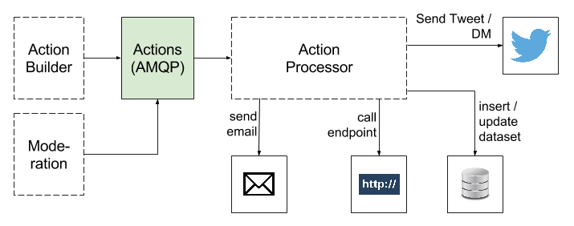

# Overview

The Action Processor microservice performs (executes) actions received from AMQP. This is done to determine if any configured actions need to be performed. Each action received from AMQP will be tagged with the ID of the widget that has the action configured.

# Architecture

The Action Processor microservice performs actions as they are received from AMQP. The actions contain all the information required for execution.



Note that the diagram excludes notifications and stats collection. The original diagram can be found in [Google Drive](https://drive.google.com/drive/u/1/folders/0B1lm7mzibBhnTi04bFFuNDNxXzQ).

# AMQP Details

## Binding

The Action Processor is bound to AMQP as follows:

- **Exchange** - bluerobot
- **Queue** - actions.process
- **Binding Key** - actions.process._\*._\*

Where the above binding key will match messages with the pattern actions.process.{action_type}.{user_id}, where: action_type is the type of action, and user_id is the ID of the user (e.g the widget owner's id)

Note that the Binding Key has a maximum length of 255 bytes (or 255 ASCII characters).

## Acknowledgement

The queues for the Blue Robot system are 'durable', i.e. they remain in tact even when the AMQP server restarts. To ensure that quality of service (QoS) is maintained, [message confirms](https://www.rabbitmq.com/confirms.html) (aka publisher acknowledgements) are used.

The action processor will only fetch one message from the queue at a time. A message will remain on the queue until it is acknowledged.

Messages should only be acknowledged when the required processing and actions have taken place. I.e. if an instance of the Action Processor microservice crashed while processing an action, the acknowledgement of the applicable action will not occur, and eventually be re-queued when the connection times out. Another instance of the Action Processor can then fetch the message from the queue to retry processing.

In the event of an error during processing, the appropriate error logging should take place, and then the action message should be acknowledged to ensure that the queue does not continue to grow in an unintended way.

## Durability

The Actions queue should be durable as durable queues remain active when a server restarts.

## Auto Delete

If set to true, the queue is deleted when all consumers have finished using it. This is not what we want.

## Actions

An action is a configured step that is performed by the Blue Robot system.

## Details Common to All Action Types

The following details are common to all action types.

### Fields

- `type` - String indicating the type of the Action. I.e. one of the following values:
  - [DATASET_INSERT](#dataset-insert)
  - [DATASET_UPDATE](#dataset-update)
  - [SEND_DM](#send-dm)
  - [SEND_REPLY](#send-reply)
  - [SEND_TWEET](#send-tweet)
  - [SEND_EMAIL](#send-email)
  - [SEND_BLAST](#send-blast)
  - [SEND_BLAST_BATCH](#send-blast-batch)
  - [SEND_DARK_TWEET](#send-dark-tweet)
  - [SEND_DARK_REPLY](#send-dark-reply)
  - [OPT_IN](#opt-in)
  - [OPT_OUT](#opt-out)
  - [CALL_ENDPOINT](#call-endpoint)
  - [SEQUENCE](#sequence)
  - [INDICATE_TYPING](#indicate-typing)
  - [SEND_FEEDBACK_REQUEST](#send-feedback-request)
  - [OVERLAY_IMAGE](#image-overlay)
  - [OVERLAY_GIF](#gif-overlay)
  - [DASHBOT_TRACK](#dashbot-track)
  - [CHATBASE_TRACK](#chatbase-track)
  - [GOOGLE_SHEET_APPEND](#google-sheet-append)
- `delay` - (Optional) time (in milliseconds) to delay the processing of actions

## Action Types

### Dataset Insert

Insert new records into a specific dataset.

#### Fields

- `dataset` - Unique identifier of the dataset to be updated
- `data` - Object to be used to insert into the dataset. If the row already exists, the action is aborted, i.e. existing data is not overridden.

### Dataset Update

Update existing records in a specific dataset.

#### Fields

- `dataset` - Unique identifier of the dataset to be updated
- `column` - Column within dataset to be updated
- `value` - Replacement value to be used for the specified column
- `searchColumn` - The column to search for the searchKey to find the row to update.
- `searchKey` - The value to be looked up on the \* searchColumn to find the row to be updated.
- `insertIfNotExist` - Boolean indicating whether a new row should be inserted if a row cannot be found.

### Send DM

Respond to an incoming Tweet or direct message with a direct message (DM).

#### Fields

- `twitterAccessTokens` - Object containing the required Twitter access tokens to perform actions on behalf of users
  - `token` - Twitter OAuth token
  - `secret` - Twitter OAuth secret
- `recipientId` - ID of the user the DM is intended for
- `text` - Text to include in the DM
- `media` - ID of the media item to attach to the DM
- `quickReply` - An array of quick reply objects
- `ctas` - An array of call to action (CTA) objects

#### Send DM Twitter endpoint

https://api.twitter.com/1.1/direct_messages/events/new.json

Below is an example of the request body we send to Twitter to send a DM

```json
{
  "event": {
    "type": "message_create",
    "message_create": {
      "target": {
        "recipient_id": "12345678"
      },
      "message_data": {
        "text": "Hello World!",
        "quick_reply": {
          "type": "options",
          "options": [
            { "label": "Red Bird", "metadata": "external_id_1" },
            { "label": "Blue Bird", "metadata": "external_id_2" }
            // ...
          ]
        },
        "ctas": [
          {
            "type": "web_url",
            "label": "See flight details",
            "url": "https://www.myairline.domain/see-flight-details"
          }
          // ...
        ]
      },
      "attachment": {
        "type": "media",
        "media": {
          // ...
        }
      }
    }
  }
}
```

### Send Reply

Respond with a specific Tweet.

#### Fields

- `twitterAccessTokens` - Object containing the required Twitter access tokens to perform actions on behalf of users
  - `token` - Twitter OAuth token
  - `secret` - Twitter OAuth secret
- `replyToStatusId` - ID of an existing status that the update is in reply to
- `screenName` - Screen name (handle) of the user the reply is intended for
- `text` - Text to include in the status. It should also include @{screenName} for it to be considered a valid reply.
- `media` - Array of IDs of the media items to attach to the Tweet

### Send Tweet

Send a specific Tweet.

#### Fields

- `twitterAccessTokens` - Object containing the required Twitter access tokens to perform actions on behalf of users
  - `token` - Twitter OAuth token
  - `secret` - Twitter OAuth secret
- `screenName` - Screen name (handle) of the user the reply is intended for
- `text` - Text to include in the status
- `media` - Array of IDs of the media items to attach to the Tweet

### Send Email

Send constructed emails.

#### Fields

- `recipients`:
  - `to` - Comma separated list of email addresses
  - `cc` - Comma separated list of email addresses
  - `bcc` - Comma separated list of email addresses
- `subject` - Email subject
- `body` - Email body
- `images` - List of image URLs to attach to the email

### Call Endpoint

Call an external endpoint.

#### Fields

- `method` - HTTP method (required)
- `url` - Endpoint address url (required)
- `headers` - Request headers object (optional)
- `body` - Request body object (optional)
- `query` - Request query object (optional)
- `form` - Request form data object (optional)
- `auth` - Request Basic Auth object (optional)
- `timeout` - Milliseconds to wait for request to be completed before assuming timeout (optional)
- `retryStatuses` - Comma separated list of HTTP status codes that should be retried (such as 408 - request timeout) (optional)

### Send Blast (Dark Tweet or DM)

Calls the Blast Processor service to trigger a Tweet blast.

#### Fields

- `widgetId` - id of the widget
- `message` - message to be sent to the user
- `media` - media ids to be sent with the tweet

### Send Blast Batch

Forwards the incoming blast batch action to the kraken queue

#### Fields

- `widgetId` - id of the widget
- `action` - action to be sent to the kraken

### Send Dark Tweet

#### Fields

Send a specific Promoted Tweet.

- `text` - Text to include in the reply
- `media` - Array of media IDs to attach to the reply
- `twitterAccessTokens` - Object containing the required Twitter access tokens to perform actions on behalf of users
  - `token` - Twitter OAuth token
  - `secret` - Twitter OAuth secret

### Send Dark Reply

#### Fields

Reply to a specific Tweet with a Promoted Tweet.

- `replyToStatusId` - ID of the tweet that this reply is meant for
- `text` - Text to include in the reply
- `media` - Array of media IDs to attach to the reply
- `twitterAccessTokens` - Object containing the required Twitter access tokens to perform actions on behalf of users
  - `token` - Twitter OAuth token
  - `secret` - Twitter OAuth secret

### Opt In

Calls the Subscriptions service to opt a user in.

#### Fields

- `widgetId` - id of the widget
- `userId` - ID of the user to opt in
- `handle` - Handle of the user being opted in
- `optinType` - Medium used to opt in (DM/TWEET/RETWEET)
- `optinId` - tweetId of Tweet OR eventId of DM

### Opt Out

Calls the Subscriptions service to opt a user in.

#### Fields

- `widgetId` - id of the widget
- `userId` - ID of the user to opt out

### Sequence

Executes a sequence of actions synchronously. Note that nesting of `SEQUENCE` actions is not permitted.

#### Fields

- `actions` - Array of actions that should be executed in order

### Indicate Typing

Sends a typing indicator to a specific user, to show that there are likely more messages to follow.

#### Fields

- `recipientId` - ID of the user the typing indicator is intended for
- `token` - Twitter OAuth token
- `secret` - Twitter OAuth secret

### Send Feedback Request

Sends a feedback card to a specific user.

#### Fields

- `token` - Twitter OAuth token
- `secret` - Twitter OAuth secret
- `feedbackType` - The Feedback type. Possible values: csat, nps (case sensitive)
- `displayName` - Overrides the display name in the question text only
- `externalId` - An open field to track case IDs, conversation IDs, etc with a max length of 256 characters.
- `message` - The Direct Message text used to introduce the Feedback prompt.
- `privacyUrl` - The URL to the sender’s hosted privacy policy.
- `questionVariantId` - The ID of the relative question variant text that will override the default text. See NPS Question Variants and CSAT Question Variants sections. Default value is 0 if not provided.
- `toUserId` - The ID of the user who should receive the Feedback prompt in a direct message.
- `test` - Boolean value. Default is false. If true, we will exclude this feedback from analytics / aggregations.
- `failureMessage` - The Direct Message text to be sent when rate limit of 1 p/24hr period has been reached

### Image Overlay

Creates an image that is the result of overlaying a provided image on top of the users profile image.

#### Fields

| Field               | Description                    | Template Support |
| ------------------- | ------------------------------ | ---------------- |
| message             | Tweet copy to use for delivery | yes              |
| overlayMediaId      | Source image id                | no               |
| profileImageUrl     | User's profile image URL       | yes              |
| twitterAccessTokens | Sender's access tokens         | no               |

#### Example

```json
{
  "type": "OVERLAY_IMAGE",
  "message": "Hey @BlueRobotStaging, here's your overlay!",
  "overlayMediaId": "media-service-image-id",
  "profileImageUrl": "http://pbs.twimg.com/profile_images/653712801219805185/S4LvoO9b.png",
  "twitterAccessTokens": {
    "token": "token",
    "secret": "secret"
  }
}
```

### GIF Overlay

#### Fields

| Field               | Description                    | Template Support |
| ------------------- | ------------------------------ | ---------------- |
| message             | Tweet copy to use for delivery | yes              |
| overlayMediaId      | Source image id                | no               |
| profileImageUrl     | User's profile image URL       | yes              |
| twitterAccessTokens | Sender's access tokens         | no               |

#### Example

```json
{
  "type": "OVERLAY_GIF",
  "message": "Hey @BlueRobotStaging, here's your overlay!",
  "overlayMediaId": "media-service-image-id",
  "profileImageUrl": "http://pbs.twimg.com/profile_images/653712801219805185/S4LvoO9b.png",
  "twitterAccessTokens": {
    "token": "token",
    "secret": "secret"
  }
}
```

Creates a GIF that is the result of overlaying a provided GIF on top of the users profile image. This is similar to the image overlay, but the process is repeated for each frame of the supplied GIF.

### Dashbot Track

Calls the Dashbot API with information about the DM

#### Fields

- `platform` - The platform being tracked (e.g. Twitter)
- `apiKey` - Dashbot API Key
- `text` - The text content of the DM
- `userId` - ID of the user to opt in
- `platformJson` - The Json directly from the platform for the DM

### Chatbase Track

Calls the Chatbase API with information about the DM

#### Fields

- `apiKey` - Chatbase API Key
- `userId` - ID of the user to opt in
- `timestamp` - The timestamp of the DM Message

### Google Sheet Append

Forwards the incoming google sheet append action to the google sheets queue

#### Fields

- `widgetId` - id of the widget
- `action` - the action to be sent to the google sheets service

# AMQP Details

- `Exchange` - `bluerobot` (topic)
- `Routing Key` - statistics.{source}.{widget_id} (routing key)
  Note that the Routing Key has a maximum length of 255 bytes (or 255 ASCII characters).

# Configuration

## Environment variables

- `NODE_ENV` - The environment node is running in.
- `AMQP_URL` - Url used for AMQP connection.
- `AMQP_HEARTBEAT` - Heartbeat (in seconds) used for AMQP connection. \*`AMQP_RECONNECT_BACKOFF_TIME` - Time (in milliseconds) that the connection retry will be delayed by. The exponential back-off strategy stipulates that the delay will by multiplied by 1, 2, 4, 8, etc. until the defined upper limit is hit.
- `AMQP_RECONNECT_BACKOFF_LIMIT` - It is recommended that this value is a equal to 2^n. This is the maximum delay that will be used for reconnecting to RabbitMQ.
- `MYSQL_HOST` - MySql hostname
- `MYSQL_PORT` - MySql port number
- `MYSQL_USER` - MySql user for authentication
- `MYSQL_PASSWORD` - MySql password for authentication
- `MYSQL_DATABASE` - Name of the database used for the connection
- `MYSQL_CONNECTION_LIMIT` - MySql connection pool limit. (Default: 10)
- `TWITTER_CONSUMER_KEY` - Consumer key to use for the Twitter connection
- `TWITTER_CONSUMER_SECRET` - Consumer secret to use for the Twitter connection
- `SMTP_HOST` - SMTP server host address
- `SMTP_PORT` - SMTP server port number
- `SMTP_USER` - SMTP user
- `SENDGRID_API_KEY` - SendGrid API key used to send mail
- `SENDGRID_EMAIL_FROM` - Email address to populate in the 'from' field of outgoing mails
- `CALL_ENDPOINT_TIMEOUT` - Timeout in milliseconds to wait before assuming the request has timed out
- `CALL_ENDPOINT_RETRY_STATUSES` - Response statuses that should be retried (defaults to 408 - request timeout, 503 - service unavailable and 504 - gateway timeout)
- `DEFAULT_RETRIES` - Defaults to 100 - The default number of times that failed actions are retried. Also used to control how many times we retry timeout errors.
